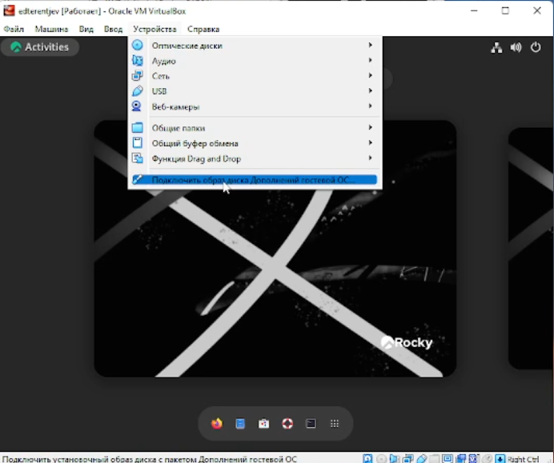
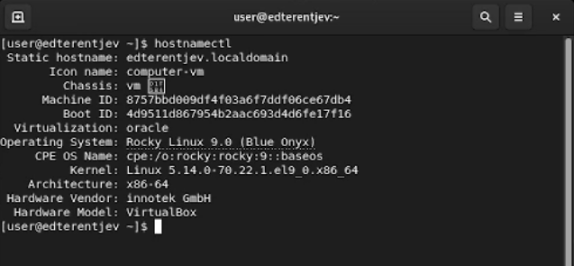
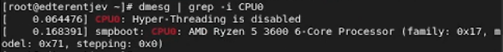
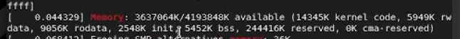
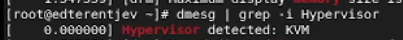

---
# Front matter
title: "Информационная безопасность. Отчет по лабораторной работе №1"
subtitle: "Установка и конфигурация операционной системы на виртуальную машину"
author: "Терентьев Егор Дмитриевич 1032192875"
group: "НФИбд-01-19"
institute: RUDN University, Moscow, Russian Federation

# Generic otions
lang: ru-RU
toc-title: "Содержание"

# Bibliography
csl: pandoc/csl/gost-r-7-0-5-2008-numeric.csl

# Pdf output format
toc: true # Table of contents
toc_depth: 2
lof: true # List of figures
lot: true # List of tables
fontsize: 12pt
linestretch: 1.5
papersize: a4
documentclass: scrreprt
### Fonts
mainfont: PT Serif
romanfont: PT Serif
sansfont: PT Sans
monofont: PT Mono
mainfontoptions: Ligatures=TeX
romanfontoptions: Ligatures=TeX
sansfontoptions: Ligatures=TeX,Scale=MatchLowercase
monofontoptions: Scale=MatchLowercase,Scale=0.9
## Biblatex
biblatex: true
biblio-style: "gost-numeric"
biblatexoptions:
  - parentracker=true
  - backend=biber
  - hyperref=auto
  - language=auto
  - autolang=other*
  - citestyle=gost-numeric
## Misc options
indent: true
header-includes:
  - \linepenalty=10 # the penalty added to the badness of each line within a paragraph (no associated penalty node) Increasing the value makes tex try to have fewer lines in the paragraph.
  - \interlinepenalty=0 # value of the penalty (node) added after each line of a paragraph.
  - \hyphenpenalty=50 # the penalty for line breaking at an automatically inserted hyphen
  - \exhyphenpenalty=50 # the penalty for line breaking at an explicit hyphen
  - \binoppenalty=700 # the penalty for breaking a line at a binary operator
  - \relpenalty=500 # the penalty for breaking a line at a relation
  - \clubpenalty=150 # extra penalty for breaking after first line of a paragraph
  - \widowpenalty=150 # extra penalty for breaking before last line of a paragraph
  - \displaywidowpenalty=50 # extra penalty for breaking before last line before a display math
  - \brokenpenalty=100 # extra penalty for page breaking after a hyphenated line
  - \predisplaypenalty=10000 # penalty for breaking before a display
  - \postdisplaypenalty=0 # penalty for breaking after a display
  - \floatingpenalty = 20000 # penalty for splitting an insertion (can only be split footnote in standard LaTeX)
  - \raggedbottom # or \flushbottom
  - \usepackage{float} # keep figures where there are in the text
  - \floatplacement{figure}{H} # keep figures where there are in the text
---

# Цель работы

Целью данной работы является приобретение практических навыков установки операционной системы на виртуальную машину,
настройки минимально необходимых для дальнейшей работы сервисов.

# Выполнение лабораторной работы

Создайте новую виртуальную машину. Для этого в VirtualBox выберите "Машина->Создать".
Укажите имя виртуальной машины (ваш логин в дисплейном классе - edterentjev), тип операционной системы — Linux, RedHat [@fig:1].

{#fig:1 width=100%}

Укажите размер основной памяти виртуальной машины (@fig:2) — 4096 МБ (или большее число, кратное 1024 МБ, если позволяют технические характеристики вашего компьютера).

{#fig:2 width=100%}

Задайте конфигурацию жёсткого диска — загрузочный,VDI (BirtualBox Disk Image), динамический виртуальный диск [@fig:3]-[@fig:5].

{#fig:3 width=100%}

{#fig:4 width=100%}

{#fig:5 width=100%}

Задайте размер диска — 40 ГБ [@fig:6].

{#fig:6 width=100%}

Выберите в VirtualBox для Вашей виртуальной машины "Настройки -> Носители". Добавьте новый привод оптических дисков и выберите образ операционной системы, скачанный с официального сайта [@fig:7].

{#fig:7 width=100%}

Запустите виртуальную машину [@fig:8], выберите язык интерфейса [@fig:9] и перейдите к настройкам установки операционной системы [@fig:10].

{#fig:8 width=100%}

{#fig:9 width=100%}

{#fig:10 width=100%}

В разделе выбора программ укажите в качестве базового окружения Server with GUI , а в качестве дополнения — Development Tools [@fig:11].

{#fig:11 width=100%}

Отключите KDUMP ([@fig:12].

{#fig:12 width=100%}

Место установки ОС оставьте без изменения [@fig:13].

{#fig:13 width=100%}

Включите сетевое соединение и в качестве имени узла указываю edterentjev.localdomain [@fig:14]

{#fig:14 width=100%}

Установите пароль для root [@fig:15] и пользователя с правами администратора [@fig:16].

{#fig:15 width=100%}

{#fig:16 width=100%}

Войдите в ОС под заданной вами при установке учётной записью. В меню
Устройства виртуальной машины подключите образ диска дополнений гостевой ОС [@fig:17], при необходимости введите пароль пользователя rootвашей виртуальной ОС.

{#fig:17 width=100%}

{#fig:18 width=100%}

После загрузки дополнений нажмите Return или Enter и корректно перезагрузите виртуальную машину.

Проверка Hostname на корректность

{#fig:19 width=100%}

Добавление user

{#fig:20 width=100%}

## Домашнее задание

Дождитесь загрузки графического окружения и откройте терминал. В окне
терминала проанализируйте последовательность загрузки системы, выполнив команду dmesg.[@fig:21].

{#fig:21 width=100%}

Можно использовать поиск с помощью grep: dmesg | grep -i "то, что ищем".
Получите следующую информацию.

1. Версия ядра Linux (Linux version) [@fig:22].
2. Частота процессора (Detected Mhz processor) [@fig:23].
3. Модель процессора (CPU0) [@fig:24].
4. Объем доступной оперативной памяти (Memory available) [@fig:25].
5. Тип обнаруженного гипервизора (Hypervisor detected) [@fig:26].
6. Тип файловой системы корневого раздела [@fig:27].
7. Последовательность монтирования файловых систем [@fig:28].

{#fig:22 width=100%}

{#fig:23 width=100%}

{#fig:24 width=100%}

{#fig:25 width=100%}

{#fig:26 width=100%}

{#fig:27 width=100%}

{#fig:28 width=100%}

# Выводы

Приобретены практические навыки установки операционной системы на виртуальную машину, настройки минимально необходимых для дальнейшей работы сервисов.

# Список литературы

1. Методические материалы курса
