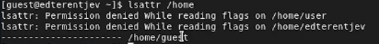
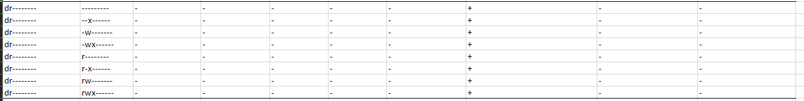
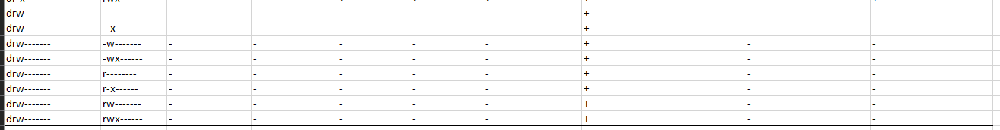
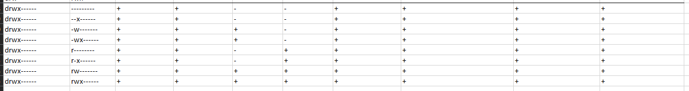
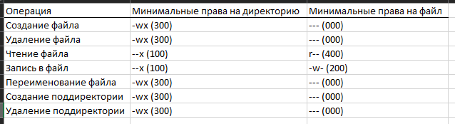

---
# Front matter
title: "Информационная безопасность. Отчет по лабораторной работе №2"
subtitle: "Дискреционное разграничение прав в Linux. Основные атрибуты"
author: "Терентьев Егор Дмитриевич 1032192875"
group: "НФИбд-01-19"
institute: RUDN University, Moscow, Russian Federation

# Generic otions
lang: ru-RU
toc-title: "Содержание"

# Bibliography
csl: pandoc/csl/gost-r-7-0-5-2008-numeric.csl

# Pdf output format
toc: true # Table of contents
toc_depth: 2
lof: true # List of figures
lot: true # List of tables
fontsize: 12pt
linestretch: 1.5
papersize: a4
documentclass: scrreprt
### Fonts
mainfont: PT Serif
romanfont: PT Serif
sansfont: PT Sans
monofont: PT Mono
mainfontoptions: Ligatures=TeX
romanfontoptions: Ligatures=TeX
sansfontoptions: Ligatures=TeX,Scale=MatchLowercase
monofontoptions: Scale=MatchLowercase,Scale=0.9
## Biblatex
biblatex: true
biblio-style: "gost-numeric"
biblatexoptions:
  - parentracker=true
  - backend=biber
  - hyperref=auto
  - language=auto
  - autolang=other*
  - citestyle=gost-numeric
## Misc options
indent: true
header-includes:
  - \linepenalty=10 # the penalty added to the badness of each line within a paragraph (no associated penalty node) Increasing the value makes tex try to have fewer lines in the paragraph.
  - \interlinepenalty=0 # value of the penalty (node) added after each line of a paragraph.
  - \hyphenpenalty=50 # the penalty for line breaking at an automatically inserted hyphen
  - \exhyphenpenalty=50 # the penalty for line breaking at an explicit hyphen
  - \binoppenalty=700 # the penalty for breaking a line at a binary operator
  - \relpenalty=500 # the penalty for breaking a line at a relation
  - \clubpenalty=150 # extra penalty for breaking after first line of a paragraph
  - \widowpenalty=150 # extra penalty for breaking before last line of a paragraph
  - \displaywidowpenalty=50 # extra penalty for breaking before last line before a display math
  - \brokenpenalty=100 # extra penalty for page breaking after a hyphenated line
  - \predisplaypenalty=10000 # penalty for breaking before a display
  - \postdisplaypenalty=0 # penalty for breaking after a display
  - \floatingpenalty = 20000 # penalty for splitting an insertion (can only be split footnote in standard LaTeX)
  - \raggedbottom # or \flushbottom
  - \usepackage{float} # keep figures where there are in the text
  - \floatplacement{figure}{H} # keep figures where there are in the text
---

# Цель работы

Целью данной работы является получение практических навыков работы в консоли с атрибутами файлов,
закрепление теоретических основ дискреционного разграничения доступа в современных системах с открытым кодом на базе ОС Linux.

# Выполнение лабораторной работы

Создаю учетную запись guest и пароль. [@fig:1].

{#fig:1 width=100%}

Вошел в систему от имени пользователя guest. Определил директорию, в которой я нахожусь, командой pwd.

{#fig:2 width=100%}

Уточните имя вашего пользователя командой whoami. [@fig:3].

{#fig:3 width=100%}

Уточните имя вашего пользователя, его группу, а также группы, куда входит пользователь, командой id. Выведенные значения uid, gid и др. запомните.
Сравните вывод id с выводом команды groups. [@fig:4]

{#fig:4 width=100%}

Просмотрите файл /etc/passwd командой `cat /etc/passwd` Найдите в нём свою учётную запись [@fig:5]

{#fig:5 width=100%}

Определите существующие в системе директории командой `ls -l /home/` [@fig:6].

{#fig:6 width=100%}

Проверьте, какие расширенные атрибуты установлены на поддиректориях, находящихся в директории /home, командой: `lsattr /home`
Атрибуты других директорий увидеть не получилось [@fig:7].

{#fig:7 width=100%}

Создайте в домашней директории поддиректорию dir1 командой `mkdir dir1`
Определите командами ls -l и lsattr, какие права доступа и расширенные атрибуты были выставлены на директорию dir1. [@fig:8]

{#fig:8 width=100%}

Снимите с директории dir1 все атрибуты командой `chmod 000 dir1`
проверьте с её помощью правильность выполнения команды `ls -l` [@fig:9]

{#fig:9 width=100%}

Попытайтесь создать в директории dir1 файл file1 командой
`echo "test" > /home/guest/dir1/file1`
Мы не смогли создать файл, так как на директории не было установлено соответствующих атрибутов, позвоялющих нам это сделать[@fig:10].

{#fig:10 width=100%}

Операции при установки директории атрибутов на chmod 000 [@fig:11].

{#fig:11 width=100%}

Операции при установки директории атрибутов на chmod 100 ([@fig:12].

{#fig:12 width=100%}

Операции при установки директории атрибутов на chmod 200 [@fig:13].

{#fig:13 width=100%}

Операции при установки директории атрибутов на chmod 300 [@fig:14]

{#fig:14 width=100%}

Операции при установки директории атрибутов на chmod 400 [@fig:15]

{#fig:15 width=100%}

Операции при установки директории атрибутов на chmod 500 [@fig:16].

{#fig:16 width=100%}

Операции при установки директории атрибутов на chmod 600 [@fig:17].

{#fig:17 width=100%}

Операции при установки директории атрибутов на chmod 700 [@fig:18].

{#fig:18 width=100%}

На основании заполненной таблицы определите те или иные минимально необходимые права для выполнения операций внутри директории dir1 [@fig:19].

{#fig:19 width=100%}

# Выводы

Приобретены практические навыки работы в консоли с атрибутами файлов,
закрепление теоретических основ дискреционного разграничения доступа в современных системах с открытым кодом на базе ОС Linux.

# Список литературы

1. Методические материалы курса
