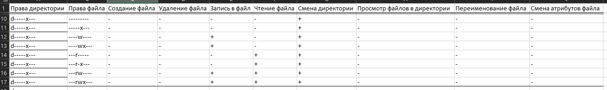
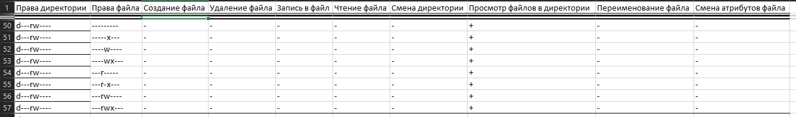

---
# Front matter
title: "Лабораторная работа 3"
author: "Терентьев Егор Дмитриевич, НФИбд-01-19"

# Generic otions
lang: ru-RU
toc-title: "Содержание"

# Bibliography
bibliography: bib/cite.bib
csl: pandoc/csl/gost-r-7-0-5-2008-numeric.csl

### Fonts
mainfont: PT Serif
romanfont: PT Serif
sansfont: PT Sans
monofont: PT Mono
mainfontoptions: Ligatures=TeX
romanfontoptions: Ligatures=TeX
sansfontoptions: Ligatures=TeX,Scale=MatchLowercase
monofontoptions: Scale=MatchLowercase,Scale=0.9
## Biblatex
biblatex: true
biblio-style: "gost-numeric"
biblatexoptions:
  - parentracker=true
  - backend=biber
  - hyperref=auto
  - language=auto
  - autolang=other*
  - citestyle=gost-numeric
## Misc options
indent: true
header-includes:
  - \linepenalty=10 # the penalty added to the badness of each line within a paragraph (no associated penalty node) Increasing the value makes tex try to have fewer lines in the paragraph.
  - \interlinepenalty=0 # value of the penalty (node) added after each line of a paragraph.
  - \hyphenpenalty=50 # the penalty for line breaking at an automatically inserted hyphen
  - \exhyphenpenalty=50 # the penalty for line breaking at an explicit hyphen
  - \binoppenalty=700 # the penalty for breaking a line at a binary operator
  - \relpenalty=500 # the penalty for breaking a line at a relation
  - \clubpenalty=150 # extra penalty for breaking after first line of a paragraph
  - \widowpenalty=150 # extra penalty for breaking before last line of a paragraph
  - \displaywidowpenalty=50 # extra penalty for breaking before last line before a display math
  - \brokenpenalty=100 # extra penalty for page breaking after a hyphenated line
  - \predisplaypenalty=10000 # penalty for breaking before a display
  - \postdisplaypenalty=0 # penalty for breaking after a display
  - \floatingpenalty = 20000 # penalty for splitting an insertion (can only be split footnote in standard LaTeX)
  - \raggedbottom # or \flushbottom
  - \usepackage{float} # keep figures where there are in the text
  - \floatplacement{figure}{H} # keep figures where there are in the text
---

##### РОССИЙСКИЙ УНИВЕРСИТЕТ ДРУЖБЫ НАРОДОВ

##### Факультет физико-математических и естественных наук

##### Кафедра прикладной информатики и теории вероятностей

##### ПРЕЗЕНТАЦИЯ ПО ЛАБОРАТОРНОЙ РАБОТЕ №3

дисциплина: Информационная безопасность

Преподователь: Кулябов Дмитрий Сергеевич

Cтудент: Терентьев Егор Дмитриевич

Группа: НФИбд-01-19

МОСКВА

2022 г.

# **Прагматика выполнения лабораторной работы**

- создание нового пользователя guest2
- работа в консоли с атрибутами файлов и директорий для групп пользователей

# **Цель работы**

Получение практических навыков работы в консоли с атрибутами файлов для групп пользователей.

# **Выполнение лабораторной работы**

# 1. Создание нового пользователя guest2 и добавление его в группу

# 2. Заполнение таблицы. Chmod 000 dir1

# 3. Заполнение таблицы. Chmod 010 dir1

# 4. Заполнение таблицы. Chmod 020 dir1

# 5. Заполнение таблицы. Chmod 030 dir1

# 6. Заполнение таблицы. Chmod 040 dir1

# 7. Заполнение таблицы. Chmod 050 dir1

# 8. Заполнение таблицы. Chmod 060 dir1

# 9. Заполнение таблицы. Chmod 070 dir1

# 10. Заполнение таблицы. Минимально необходимые права для выполнения операций внутри директории dir1

# Выводы

Выполнив данную лабораторную работу, я приобрел практические навыки работы в консоли с атрибутами файлов для групп пользователей.
