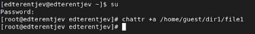
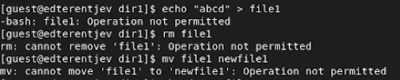

---
# Front matter
title: "Лабораторная работа 4"
author: "Терентьев Егор Дмитриевич, НФИбд-01-19"

# Generic otions
lang: ru-RU
toc-title: "Содержание"

# Bibliography
bibliography: bib/cite.bib
csl: pandoc/csl/gost-r-7-0-5-2008-numeric.csl

### Fonts
mainfont: PT Serif
romanfont: PT Serif
sansfont: PT Sans
monofont: PT Mono
mainfontoptions: Ligatures=TeX
romanfontoptions: Ligatures=TeX
sansfontoptions: Ligatures=TeX,Scale=MatchLowercase
monofontoptions: Scale=MatchLowercase,Scale=0.9
## Biblatex
biblatex: true
biblio-style: "gost-numeric"
biblatexoptions:
  - parentracker=true
  - backend=biber
  - hyperref=auto
  - language=auto
  - autolang=other*
  - citestyle=gost-numeric
## Misc options
indent: true
header-includes:
  - \linepenalty=10 # the penalty added to the badness of each line within a paragraph (no associated penalty node) Increasing the value makes tex try to have fewer lines in the paragraph.
  - \interlinepenalty=0 # value of the penalty (node) added after each line of a paragraph.
  - \hyphenpenalty=50 # the penalty for line breaking at an automatically inserted hyphen
  - \exhyphenpenalty=50 # the penalty for line breaking at an explicit hyphen
  - \binoppenalty=700 # the penalty for breaking a line at a binary operator
  - \relpenalty=500 # the penalty for breaking a line at a relation
  - \clubpenalty=150 # extra penalty for breaking after first line of a paragraph
  - \widowpenalty=150 # extra penalty for breaking before last line of a paragraph
  - \displaywidowpenalty=50 # extra penalty for breaking before last line before a display math
  - \brokenpenalty=100 # extra penalty for page breaking after a hyphenated line
  - \predisplaypenalty=10000 # penalty for breaking before a display
  - \postdisplaypenalty=0 # penalty for breaking after a display
  - \floatingpenalty = 20000 # penalty for splitting an insertion (can only be split footnote in standard LaTeX)
  - \raggedbottom # or \flushbottom
  - \usepackage{float} # keep figures where there are in the text
  - \floatplacement{figure}{H} # keep figures where there are in the text
---

##### РОССИЙСКИЙ УНИВЕРСИТЕТ ДРУЖБЫ НАРОДОВ

##### Факультет физико-математических и естественных наук

##### Кафедра прикладной информатики и теории вероятностей

##### ПРЕЗЕНТАЦИЯ ПО ЛАБОРАТОРНОЙ РАБОТЕ №4

дисциплина: Информационная безопасность

Преподователь: Кулябов Дмитрий Сергеевич

Cтудент: Терентьев Егор Дмитриевич

Группа: НФИбд-01-19

МОСКВА

2022 г.

# **Прагматика выполнения лабораторной работы**

- работа в консоли с расширенными атрибутами файлов:
  1. Расширенный атрибут _a_
  2. Расширенный атрибут _i_

# **Цель работы**

Получение практических навыков работы в консоли с расширенными атрибутами файлов.

# **Выполнение лабораторной работы**

# 1. Нам нужно было задать файлу расширенный атрибут _a_ от суперпользователя

# 2. Затем нам нужно было проверить можем ли мы дозаписывать в файл, изменять, удалять или переименовывать файл

## Пробуем дозаписать в файл

## Проверяем перезапись, удаление, переименование

## Вывод по атрибуту а

Т.е файл с атрибутом _a_ можно открыть только в режиме добавления для записи. Только суперпользователь или процесс, обладающий возможностью CAP_LINUX_IMMUTABLE,
может установить или очистить этот атрибут.

# 3. Нам нужно было задать файлу расширенный атрибут _i_ и убрать _a_ от суперпользователя

# 4. Затем проводим те же операции с файлом только теперь с атрибутом i

## Пробуем дозаписать в файл

## Проверяем перезапись, удаление, переименование

## Вывод по атрибуту i

По итогу: файл с атрибутом «i» не может быть изменён: его нельзя удалить или переименовать, нельзя создать ссылку на этот файл, большую часть метаданных файла нельзя изменить, и файл нельзя открыть в режиме записи. Только суперпользователь или процесс, обладающий возможностью CAP_LINUX_IMMUTABLE, может установить или очистить этот атрибут

# Выводы

В результате выполнения работы вы повысили свои навыки использования интерфейса командой строки (CLI), познакомились на примерах с тем,
как используются основные и расширенные атрибуты при разграничении доступа.
Имели возможность связать теорию дискреционного разделения доступа (дискреционная политика безопасности) с её реализацией на практике в ОС Linux.
Составили наглядные таблицы, поясняющие какие операции возможны при тех или иных установленных правах. Опробовали действие на практике расширенных атрибутов «а» и «i».
