---
# Front matter
title: "Информационная безопасность. Отчет по лабораторной работе №4"
subtitle: "Дискреционное разграничение прав в Linux. Расширенные атрибуты"
author: "Терентьев Егор Дмитриевич 1032192875"
group: "НФИбд-01-19"
institute: RUDN University, Moscow, Russian Federation

# Generic otions
lang: ru-RU
toc-title: "Содержание"

# Bibliography
csl: pandoc/csl/gost-r-7-0-5-2008-numeric.csl

# Pdf output format
toc: true # Table of contents
toc_depth: 2
lof: true # List of figures
lot: true # List of tables
fontsize: 12pt
linestretch: 1.5
papersize: a4
documentclass: scrreprt
### Fonts
mainfont: PT Serif
romanfont: PT Serif
sansfont: PT Sans
monofont: PT Mono
mainfontoptions: Ligatures=TeX
romanfontoptions: Ligatures=TeX
sansfontoptions: Ligatures=TeX,Scale=MatchLowercase
monofontoptions: Scale=MatchLowercase,Scale=0.9
## Biblatex
biblatex: true
biblio-style: "gost-numeric"
biblatexoptions:
  - parentracker=true
  - backend=biber
  - hyperref=auto
  - language=auto
  - autolang=other*
  - citestyle=gost-numeric
## Misc options
indent: true
header-includes:
  - \linepenalty=10 # the penalty added to the badness of each line within a paragraph (no associated penalty node) Increasing the value makes tex try to have fewer lines in the paragraph.
  - \interlinepenalty=0 # value of the penalty (node) added after each line of a paragraph.
  - \hyphenpenalty=50 # the penalty for line breaking at an automatically inserted hyphen
  - \exhyphenpenalty=50 # the penalty for line breaking at an explicit hyphen
  - \binoppenalty=700 # the penalty for breaking a line at a binary operator
  - \relpenalty=500 # the penalty for breaking a line at a relation
  - \clubpenalty=150 # extra penalty for breaking after first line of a paragraph
  - \widowpenalty=150 # extra penalty for breaking before last line of a paragraph
  - \displaywidowpenalty=50 # extra penalty for breaking before last line before a display math
  - \brokenpenalty=100 # extra penalty for page breaking after a hyphenated line
  - \predisplaypenalty=10000 # penalty for breaking before a display
  - \postdisplaypenalty=0 # penalty for breaking after a display
  - \floatingpenalty = 20000 # penalty for splitting an insertion (can only be split footnote in standard LaTeX)
  - \raggedbottom # or \flushbottom
  - \usepackage{float} # keep figures where there are in the text
  - \floatplacement{figure}{H} # keep figures where there are in the text
---

# Цель работы

Получение практических навыков работы в консоли с расширенными атрибутами файлов.

# Выполнение лабораторной работы

От имени пользователя guest определите расширенные атрибуты файла [@fig:1].

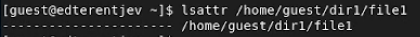{#fig:1 width=100%}

Установите командой chmod 600 file1 на файл file1 права, разрешающие чтение и запись для владельца файла

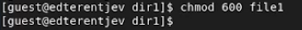{#fig:2 width=100%}

Попробуйте установить на файл /home/guest/dir1/file1 расширенный атрибут a от имени пользователя guest и получили отказ [@fig:3].

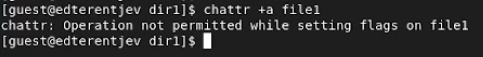{#fig:3 width=100%}

Зайдите на третью консоль с правами администратора либо повысьтесвои права с помощью команды su.
Попробуйте установить расширенный атрибут a на файл /home/guest/dir1/file1 от имени суперпользователя: [@fig:4]

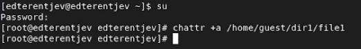{#fig:4 width=100%}

От пользователя guest проверьте правильность установления атрибута: lsattr /home/guest/dir1/file1 [@fig:5]

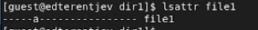{#fig:5 width=100%}

Выполните дозапись в файл file1 [@fig:6].

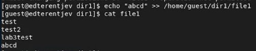{#fig:6 width=100%}

Попробуйте удалить файл file1 либо стереть имеющуюся в нём информацию. Попробуйте переименовать файл. [@fig:7].

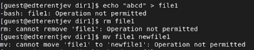{#fig:7 width=100%}

Установить на файл file1 права, например, запрещающие чтение и запись для владельца файла. [@fig:8]

{#fig:8 width=100%}

Т.е файл с атрибутом _a_ можно открыть только в режиме добавления для записи. Только суперпользователь или процесс, обладающий возможностью CAP_LINUX_IMMUTABLE,
может установить или очистить этот атрибут.

Снимите расширенный атрибут a с файла /home/guest/dirl/file1 от имени суперпользователя [@fig:9].

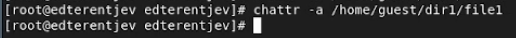{#fig:9 width=100%}

Устанавливаю расширенный атрибут _i_ [@fig:10].

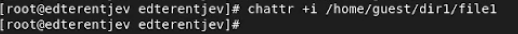{#fig:10 width=100%}

Пробую добавить информацию в файл с атрибутом i [@fig:11].

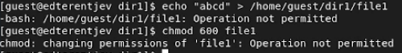{#fig:11 width=100%}

Дальше пробую изменить файл, переименовать, удалить с атрибутом i [@fig:12]

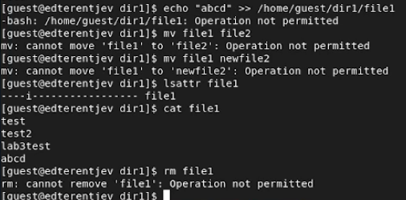{#fig:12 width=100%}

По итогу: файл с атрибутом «i» не может быть изменён: его нельзя удалить или переименовать, нельзя создать ссылку на этот файл, большую часть метаданных файла нельзя изменить, и файл нельзя открыть в режиме записи. Только суперпользователь или процесс, обладающий возможностью CAP_LINUX_IMMUTABLE, может установить или очистить этот атрибут

# Выводы

В результате выполнения работы вы повысили свои навыки использования интерфейса командой строки (CLI), познакомились на примерах с тем,
как используются основные и расширенные атрибуты при разграничении доступа.
Имели возможность связать теорию дискреционного разделения доступа (дискреционная политика безопасности) с её реализацией на практике в ОС Linux.
Составили наглядные таблицы, поясняющие какие операции возможны при тех или иных установленных правах. Опробовали действие на практике расширенных атрибутов «а» и «i».

# Список литературы

1. Методические материалы курса
