---
# Front matter
title: "Информационная безопасность. Отчет по лабораторной работе №5"
subtitle: "Дискреционное разграничение прав в Linux. Исследование влияния дополнительных атрибутов"
author: "Терентьев Егор Дмитриевич 1032192875"
group: "НФИбд-01-19"
institute: RUDN University, Moscow, Russian Federation

# Generic otions
lang: ru-RU
toc-title: "Содержание"

# Bibliography
csl: pandoc/csl/gost-r-7-0-5-2008-numeric.csl

# Pdf output format
toc: true # Table of contents
toc_depth: 2
lof: true # List of figures
lot: true # List of tables
fontsize: 12pt
linestretch: 1.5
papersize: a4
documentclass: scrreprt
### Fonts
mainfont: PT Serif
romanfont: PT Serif
sansfont: PT Sans
monofont: PT Mono
mainfontoptions: Ligatures=TeX
romanfontoptions: Ligatures=TeX
sansfontoptions: Ligatures=TeX,Scale=MatchLowercase
monofontoptions: Scale=MatchLowercase,Scale=0.9
## Biblatex
biblatex: true
biblio-style: "gost-numeric"
biblatexoptions:
  - parentracker=true
  - backend=biber
  - hyperref=auto
  - language=auto
  - autolang=other*
  - citestyle=gost-numeric
## Misc options
indent: true
header-includes:
  - \linepenalty=10 # the penalty added to the badness of each line within a paragraph (no associated penalty node) Increasing the value makes tex try to have fewer lines in the paragraph.
  - \interlinepenalty=0 # value of the penalty (node) added after each line of a paragraph.
  - \hyphenpenalty=50 # the penalty for line breaking at an automatically inserted hyphen
  - \exhyphenpenalty=50 # the penalty for line breaking at an explicit hyphen
  - \binoppenalty=700 # the penalty for breaking a line at a binary operator
  - \relpenalty=500 # the penalty for breaking a line at a relation
  - \clubpenalty=150 # extra penalty for breaking after first line of a paragraph
  - \widowpenalty=150 # extra penalty for breaking before last line of a paragraph
  - \displaywidowpenalty=50 # extra penalty for breaking before last line before a display math
  - \brokenpenalty=100 # extra penalty for page breaking after a hyphenated line
  - \predisplaypenalty=10000 # penalty for breaking before a display
  - \postdisplaypenalty=0 # penalty for breaking after a display
  - \floatingpenalty = 20000 # penalty for splitting an insertion (can only be split footnote in standard LaTeX)
  - \raggedbottom # or \flushbottom
  - \usepackage{float} # keep figures where there are in the text
  - \floatplacement{figure}{H} # keep figures where there are in the text
---

# Цель работы

Изучение механизмов изменения идентификаторов, применения SetUID- и Sticky-битов.
Получение практических навыков работы в консоли с дополнительными атрибутами.
Рассмотрение работы механизма смены идентификатора процессов пользователей, а также влияние бита Sticky на запись и удаление файлов.

# Выполнение лабораторной работы

Вхожу в систему от guest и создаю программу simpleid.c [@fig:1].

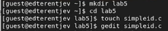{#fig:1 width=100%}

Листинг программы simpleid [@fig:2].

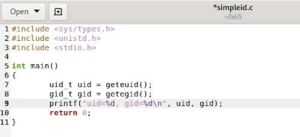{#fig:2 width=100%}

Скомплилируйте программу и убедитесь, что файл программы создан:`gcc simpleid.c -o simpleid`.
Выполните программу simpleid: `./simpleid`. Выполните системную программу id: [@fig:3].

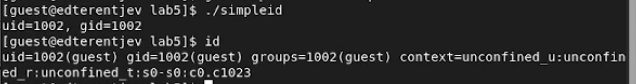{#fig:3 width=100%}

Усложните программу, добавив вывод действительных идентификаторов и назовите ее simpleid2 [@fig:4]

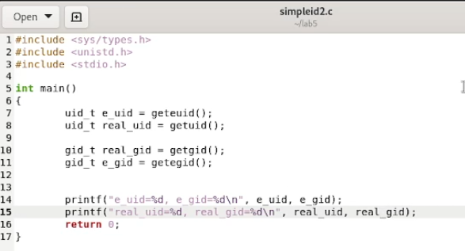{#fig:4 width=100%}

Скомпилируйте и запустите simpleid2.c [@fig:5]

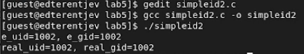{#fig:5 width=100%}

От имени суперпользователя выполните команды: `chown root:guest /home/guest/simpleid2` `chmod u+s /home/guest/simpleid2` [@fig:6].

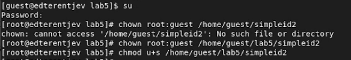{#fig:6 width=100%}

Выполните проверку правильности установки новых атрибутов и смены владельца файла simpleid2: `ls -l simpleid2`
Запустите simpleid2 и id: `./simpleid2 id` [@fig:7].

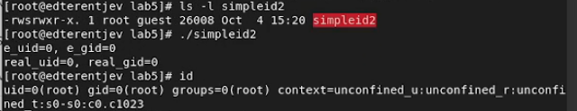{#fig:7 width=100%}

Проделайте тоже самое относительно SetGID-бита [@fig:8]

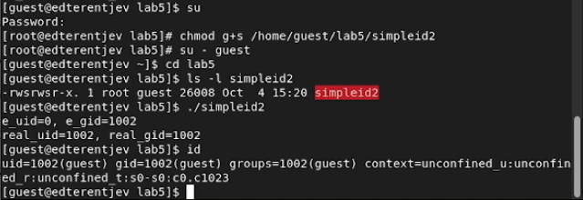{#fig:8 width=100%}

Создайте программу readfile.c [@fig:9].

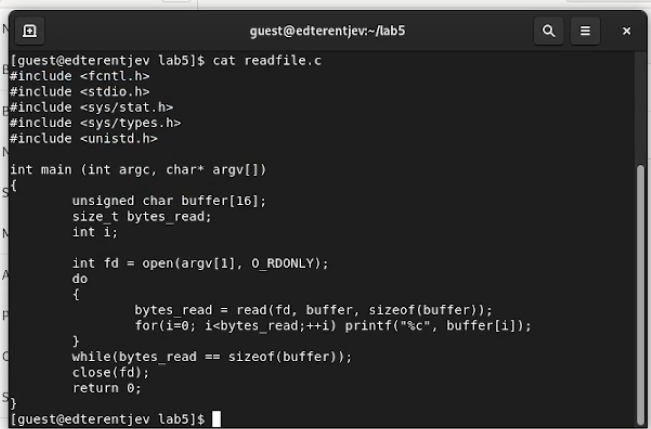{#fig:9 width=100%}

Смените владельца у файла readfile.c и измените права так, чтобы только суперпользователь (root) мог прочитать его, a guest не мог [@fig:10].

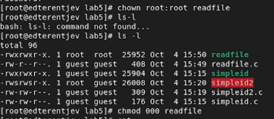{#fig:10 width=100%}

Проверьте, что пользователь guest не может прочитать файл readfile.c. Смените у программы readfile владельца и установите SetU’D-бит. [@fig:11].

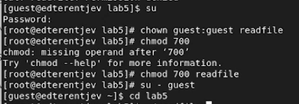{#fig:11 width=100%}

Проверьте, может ли программа readfile прочитать файл readfile.c? [@fig:12]

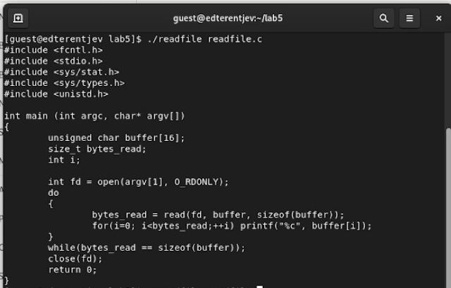{#fig:12 width=100%}

Выясните, установлен ли атрибут Sticky на директории /tmp
От имени пользователя guest создайте файл file01.txt в директории /tmp со словом test:
Просмотрите атрибуты у только что созданного файла и разрешите чтение и запись для категории пользователей «все остальные» [@fig:13]

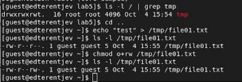{#fig:13 width=100%}

От пользователя guest2 (не являющегося владельцем) попробуйте прочитать файл /tmp/file01.txt
От пользователя guest2 попробуйте дозаписать в файл /tmp/file01.txt слово test2
Проверьте содержимое файла
От пользователя guest2 попробуйте записать в файл /tmp/file01.txt
Проверьте содержимое файла
От пользователя guest2 попробуйте удалить файл /tmp/file01.txt [@fig:14]

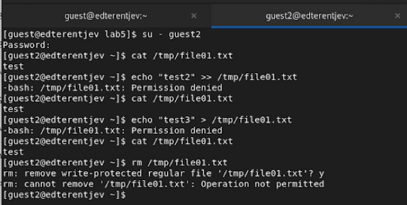{#fig:14 width=100%}

Повысьте свои права до суперпользователя и выполните после этого команду, снимающую атрибут t (Sticky-бит) с директории /tmp
От пользователя guest2 проверьте, что атрибута t у директории /tmp нет:
Повторите предыдущие шаги [@fig:15]

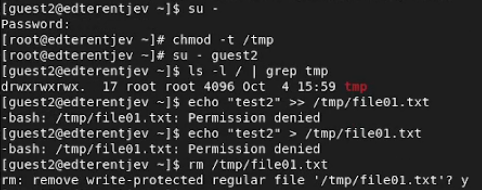{#fig:15 width=100%}

Повысьте свои права до суперпользователя и верните атрибут t на директорию /tmp [@fig:16]

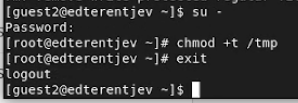{#fig:16 width=100%}

# Выводы

В результате выполнения работы я изученил механизмы изменения идентификаторов, применения SetUID- и Sticky-битов,
получил практические навыки работы в консоли с дополнительными атрибутами, а также
рассмотрел работы механизма смены идентификатора процессов пользователей и влияние бита Sticky на запись и удаление файлов.

# Список литературы

1. Методические материалы курса
