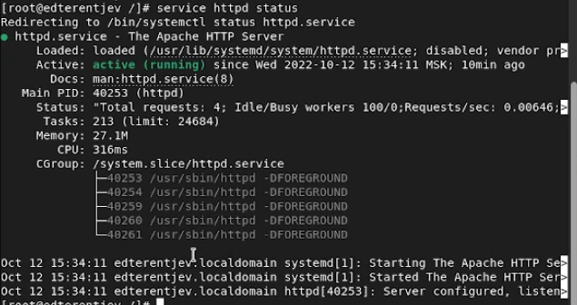
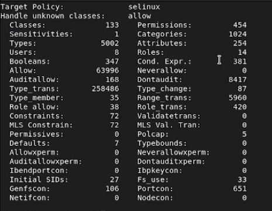
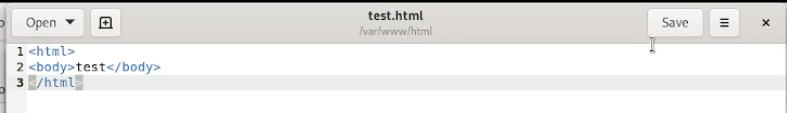
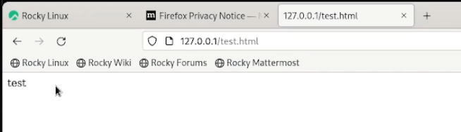
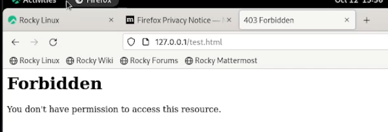
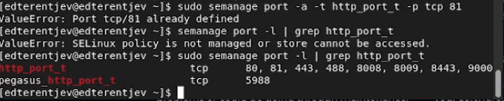
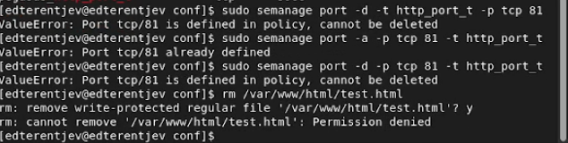

---
# Front matter
title: "Лабораторная работа 6"
author: "Терентьев Егор Дмитриевич, НФИбд-01-19"

# Generic otions
lang: ru-RU
toc-title: "Содержание"

# Bibliography
bibliography: bib/cite.bib
csl: pandoc/csl/gost-r-7-0-5-2008-numeric.csl

### Fonts
mainfont: PT Serif
romanfont: PT Serif
sansfont: PT Sans
monofont: PT Mono
mainfontoptions: Ligatures=TeX
romanfontoptions: Ligatures=TeX
sansfontoptions: Ligatures=TeX,Scale=MatchLowercase
monofontoptions: Scale=MatchLowercase,Scale=0.9
## Biblatex
biblatex: true
biblio-style: "gost-numeric"
biblatexoptions:
  - parentracker=true
  - backend=biber
  - hyperref=auto
  - language=auto
  - autolang=other*
  - citestyle=gost-numeric
## Misc options
indent: true
header-includes:
  - \linepenalty=10 # the penalty added to the badness of each line within a paragraph (no associated penalty node) Increasing the value makes tex try to have fewer lines in the paragraph.
  - \interlinepenalty=0 # value of the penalty (node) added after each line of a paragraph.
  - \hyphenpenalty=50 # the penalty for line breaking at an automatically inserted hyphen
  - \exhyphenpenalty=50 # the penalty for line breaking at an explicit hyphen
  - \binoppenalty=700 # the penalty for breaking a line at a binary operator
  - \relpenalty=500 # the penalty for breaking a line at a relation
  - \clubpenalty=150 # extra penalty for breaking after first line of a paragraph
  - \widowpenalty=150 # extra penalty for breaking before last line of a paragraph
  - \displaywidowpenalty=50 # extra penalty for breaking before last line before a display math
  - \brokenpenalty=100 # extra penalty for page breaking after a hyphenated line
  - \predisplaypenalty=10000 # penalty for breaking before a display
  - \postdisplaypenalty=0 # penalty for breaking after a display
  - \floatingpenalty = 20000 # penalty for splitting an insertion (can only be split footnote in standard LaTeX)
  - \raggedbottom # or \flushbottom
  - \usepackage{float} # keep figures where there are in the text
  - \floatplacement{figure}{H} # keep figures where there are in the text
---

##### РОССИЙСКИЙ УНИВЕРСИТЕТ ДРУЖБЫ НАРОДОВ

##### Факультет физико-математических и естественных наук

##### Кафедра прикладной информатики и теории вероятностей

##### ПРЕЗЕНТАЦИЯ ПО ЛАБОРАТОРНОЙ РАБОТЕ №6

дисциплина: Информационная безопасность

Преподователь: Кулябов Дмитрий Сергеевич

Cтудент: Терентьев Егор Дмитриевич

Группа: НФИбд-01-19

МОСКВА

2022 г.

# **Прагматика выполнения лабораторной работы**

- Администрирования ОС Linux:
  1. Работа с SELinux
  2. Работа с веб-сервером Apache

# **Цель работы**

Развить навыки администрирования ОС Linux. Получить первое практическое знакомство с технологией SELinux.
Проверить работу SELinx на практике совместно с веб-сервером Apache.

# **Выполнение лабораторной работы**

# 1. Войдите в систему с полученными учётными данными и убедитесь, что SELinux работает в режиме enforcing политики targeted

# 2. Обратитесь с помощью браузера к веб-серверу, запущенному на вашем компьютере, и убедитесь, что последний работает

# 3. Посмотрите статистику по политике с помощью команды seinfo, также определите множество пользователей, ролей, типов.

# 4. Создайте от имени суперпользователя (так как в дистрибутиве после установки только ему разрешена запись в директорию) html-файл

# 5. Обратитесь к файлу через веб-сервер, введя в браузере адрес http://127.0.0.1/test.html. Убедитесь, что файл был успешно отображён.

# 6. Проверить контекст файла и измените контекст файла

меняю с httpd_sys_content_t на samba_share_t

# 7. Попробуйте ещё раз получить доступ к файлу через веб-сервер.

# 8. Попробуйте запустить веб-сервер Apache на прослушивание ТСР-порта 81 и делаем привязку

# 9. Удалите привязку http_port_t к 81 порту и проверьте, что порт 81 удалён. (Удалить привязку невозможно)

# Выводы

В результате выполнения работы я развитл навыки администрирования ОС Linux. Получил первое практическое знакомство с технологией SELinux,
а также проверил работу SELinx на практике совместно с веб-сервером Apache.
