---
# Front matter
title: "Информационная безопасность. Отчет по лабораторной работе №6"
subtitle: "Мандатное разграничение прав в Linux"
author: "Терентьев Егор Дмитриевич 1032192875"
group: "НФИбд-01-19"
institute: RUDN University, Moscow, Russian Federation

# Generic otions
lang: ru-RU
toc-title: "Содержание"

# Bibliography
csl: pandoc/csl/gost-r-7-0-5-2008-numeric.csl

# Pdf output format
toc: true # Table of contents
toc_depth: 2
lof: true # List of figures
lot: true # List of tables
fontsize: 12pt
linestretch: 1.5
papersize: a4
documentclass: scrreprt
### Fonts
mainfont: PT Serif
romanfont: PT Serif
sansfont: PT Sans
monofont: PT Mono
mainfontoptions: Ligatures=TeX
romanfontoptions: Ligatures=TeX
sansfontoptions: Ligatures=TeX,Scale=MatchLowercase
monofontoptions: Scale=MatchLowercase,Scale=0.9
## Biblatex
biblatex: true
biblio-style: "gost-numeric"
biblatexoptions:
  - parentracker=true
  - backend=biber
  - hyperref=auto
  - language=auto
  - autolang=other*
  - citestyle=gost-numeric
## Misc options
indent: true
header-includes:
  - \linepenalty=10 # the penalty added to the badness of each line within a paragraph (no associated penalty node) Increasing the value makes tex try to have fewer lines in the paragraph.
  - \interlinepenalty=0 # value of the penalty (node) added after each line of a paragraph.
  - \hyphenpenalty=50 # the penalty for line breaking at an automatically inserted hyphen
  - \exhyphenpenalty=50 # the penalty for line breaking at an explicit hyphen
  - \binoppenalty=700 # the penalty for breaking a line at a binary operator
  - \relpenalty=500 # the penalty for breaking a line at a relation
  - \clubpenalty=150 # extra penalty for breaking after first line of a paragraph
  - \widowpenalty=150 # extra penalty for breaking before last line of a paragraph
  - \displaywidowpenalty=50 # extra penalty for breaking before last line before a display math
  - \brokenpenalty=100 # extra penalty for page breaking after a hyphenated line
  - \predisplaypenalty=10000 # penalty for breaking before a display
  - \postdisplaypenalty=0 # penalty for breaking after a display
  - \floatingpenalty = 20000 # penalty for splitting an insertion (can only be split footnote in standard LaTeX)
  - \raggedbottom # or \flushbottom
  - \usepackage{float} # keep figures where there are in the text
  - \floatplacement{figure}{H} # keep figures where there are in the text
---

# Цель работы

Развить навыки администрирования ОС Linux. Получить первое практическое знакомство с технологией SELinux.
Проверить работу SELinx на практике совместно с веб-сервером Apache.

# Выполнение лабораторной работы

Войдите в систему с полученными учётными данными и убедитесь, что SELinux работает в режиме enforcing политики targeted с помощью команд getenforce и sestatus. [@fig:1].

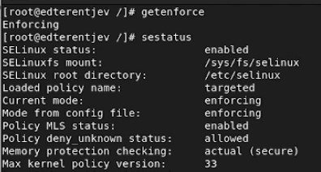{#fig:1 width=100%}

Обратитесь с помощью браузера к веб-серверу, запущенному на вашем компьютере, и убедитесь, что последний работает [@fig:2].

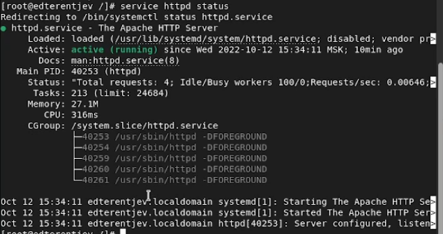{#fig:2 width=100%}

Найдите веб-сервер Apache в списке процессов, определите его контекст безопасности и занесите эту информацию в отчёт: `system_u:system_r:httpd_t:s0` [@fig:3].

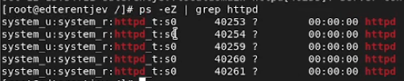{#fig:3 width=100%}

Посмотрите текущее состояние переключателей SELinux для Apache [@fig:4]

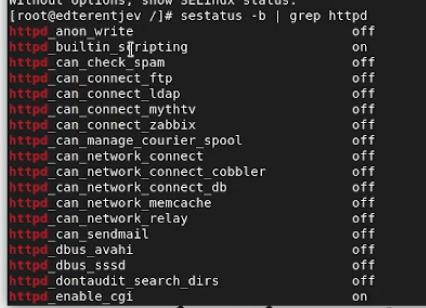{#fig:4 width=100%}

Посмотрите статистику по политике с помощью команды seinfo, также определите множество пользователей, ролей, типов. [@fig:5]

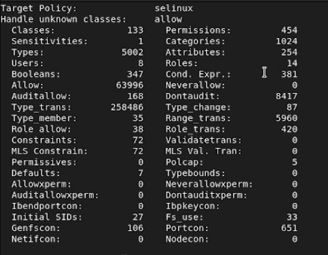{#fig:5 width=100%}

Определите тип файлов и поддиректорий, находящихся в директории /var/www, с помощью команды ls -lZ /var/www
Определите тип файлов, находящихся в директории /var/www/html: ls -lZ /var/www/html [@fig:6].

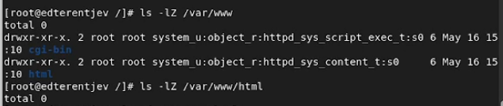{#fig:6 width=100%}

Создайте от имени суперпользователя (так как в дистрибутиве после установки только ему разрешена запись в директорию) html-файл [@fig:7].

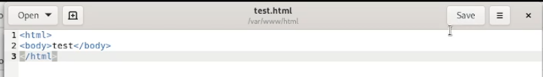{#fig:7 width=100%}

Обратитесь к файлу через веб-сервер, введя в браузере адрес http://127.0.0.1/test.html. Убедитесь, что файл был успешно отображён. [@fig:8]

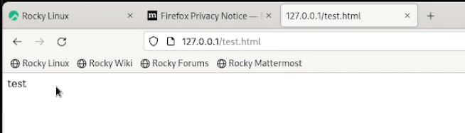{#fig:8 width=100%}

Проверить контекст файла. Измените контекст файла /var/www/html/test.html с
httpd_sys_content_t на любой другой, к которому процесс httpd не
должен иметь доступа, например, на samba_share_t [@fig:9].

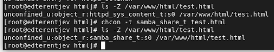{#fig:9 width=100%}

Попробуйте ещё раз получить доступ к файлу через веб-сервер, введя в браузере адрес http://127.0.0.1/test.html.
Вы должны получить сообщение об ошибке [@fig:10].

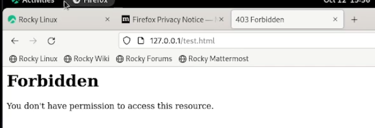{#fig:10 width=100%}

ls -l /var/www/html/test.html Просмотрите log-файлы веб-сервера Apache. Также просмотрите системный лог-файл:
tail /var/log/messages [@fig:11].

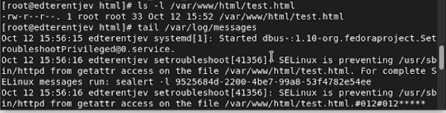{#fig:11 width=100%}

Попробуйте запустить веб-сервер Apache на прослушивание ТСР-порта 81.
Выполните перезапуск веб-сервера Apache. Произошёл сбой?
Проанализируйте лог-файлы. [@fig:12]

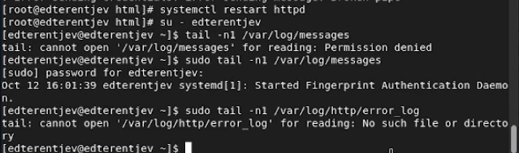{#fig:12 width=100%}

Выполните команду
semanage port -a -t http_port_t -р tcp 81
После этого проверьте список портов командой
semanage port -l | grep http_port_t
Убедитесь, что порт 81 появился в списке. [@fig:13]

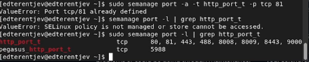{#fig:13 width=100%}

Верните контекст httpd_sys_cоntent_t к файлу /var/www/html/ test.html [@fig:14]

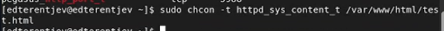{#fig:14 width=100%}

Удалите привязку http_port_t к 81 порту и проверьте, что порт 81 удалён. (Удалить привязку невозможно)
Удалите файл /var/www/html/test.html [@fig:15]

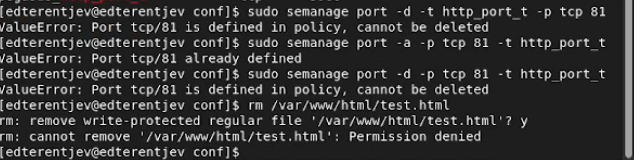{#fig:15 width=100%}

# Выводы

В результате выполнения работы я развитл навыки администрирования ОС Linux. Получил первое практическое знакомство с технологией SELinux,
а также проверил работу SELinx на практике совместно с веб-сервером Apache.

# Список литературы

1. Методические материалы курса
